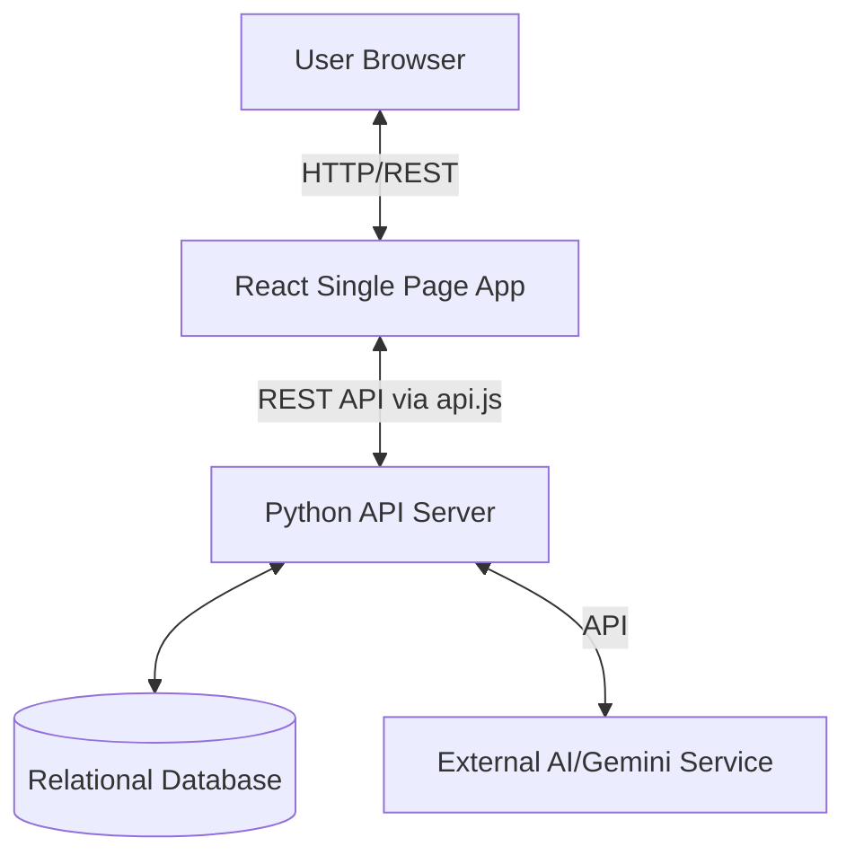

# Health Application Architecture

## 1. System Overview
This project is a full-stack health and wellness web application. It follows a classic client-server architecture, utilizing a **React** frontend and a **Python** (most likely FastAPI or Flask) backend. The entire application is containerized using **Docker** and orchestrated via **Docker Compose**.

## 2. High-Level Architecture Diagram

## 3. Component Breakdown

### 3.1. Frontend (`/frontend`)
The frontend is a React-based Single Page Application (SPA). 
- **Core Technologies**: React.js, HTML/CSS, JavaScript/JSX.
- **Web Server**: NGINX (`nginx.conf`) is used to serve the static built files in production.
- **Key Directories**:
  - `src/components/`: Contains modular UI elements:
    - **Authentication**: `Login.jsx`, `Register.jsx`
    - **User Interface**: `Dashboard.jsx`, `AppointmentScheduler.jsx`
    - **Health Modules**: `HealthDataForm.jsx`, `HealthChart.jsx`, `MedicineChecker.jsx`
    - **AI Integration**: `ChatBot.jsx`
  - `src/services/api.js`: Acts as the HTTP client (likely wrapping `axios` or `fetch`) to communicate with the backend API.

### 3.2. Backend (`/backend`)
The backend provides RESTful API endpoints for the frontend, manages business logic, and integrates with the database and external services.
- **Core Technologies**: Python, likely FastAPI (due to the `routers` directory convention) or Flask/SQLAlchemy.
- **Key Directories & Modules**:
  - **`app/main.py`**: The entry point of the application where the server is initialized.
  - **`app/routers/`**: Defines the API endpoints (Controllers):
    - `auth.py`: Handles user registration, login, and JWT tokens.
    - `health.py`: Manages user health data CRUD operations.
    - `appointments.py`: Scheduling and managing appointments.
    - `chat.py`: Handles chatbot interactions.
  - **`app/services/`**: Contains the core business logic and external integrations:
    - `gemini_service.py`: Integrates with Google's Gemini LLM for AI features (e.g., the ChatBot).
    - `prediction_service.py`: Likely contains ML/data logic to analyze health data.
    - `medicine_checker.py`: Logic to verify medicines, interactions, or uses.
  - **`app/models/`**: Defines the databse schema and ORM models (`user.py`, `appointment.py`, `health_data.py`).
  - **`app/utils/security.py`**: Handles password hashing, security, and authentication utilities.
  - **`app/database.py`**: Manages the database connection and sessions.

### 3.3. Infrastructure & Deployment
- **Docker**: Both backend and frontend have their own `Dockerfile`. 
- **Docker Compose**: The `docker-compose.yml` file at the root level orchestrates the frontend, backend, and likely the database containers to run together seamlessly in a localized environment.

## 4. Data Flow Example (ChatBot Request)
1. **User Action**: The user types a message in `ChatBot.jsx` on the frontend.
2. **API Call**: `api.js` sends a POST request to the backend's `/chat` endpoint.
3. **Routing**: The backend router (`app/routers/chat.py`) receives the request.
4. **Processing**: The router calls `gemini_service.py` to process the user's prompt using the Gemini AI API.
5. **Response**: The AI response is sent back down the chain to the React frontend, which updates the UI.
